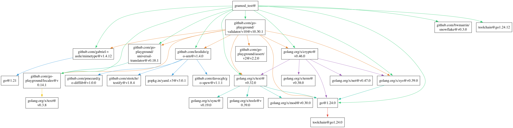
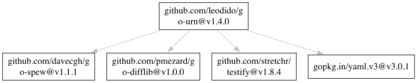
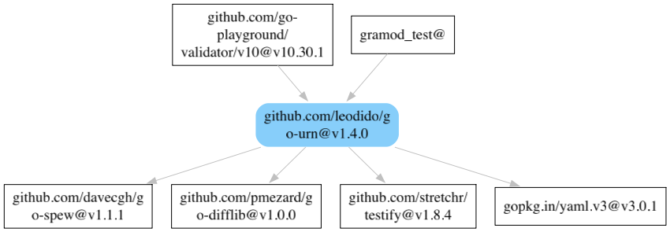

[English](https://github.com/xingliuhua/gramod/blob/master/README.md)

# gramod

一个轻量级的 **Go 模块依赖可视化工具**。

`gramod` 会解析 `go mod graph` 的输出内容，并生成直观、准确的 PNG 依赖图，  
帮助你更清楚地了解项目中各个 Go 模块之间的依赖关系。


## ✨ 功能特性

- **完整依赖图**：可视化整个项目的所有模块依赖。
- **目标模式**：只展示某个模块的依赖树（`--target`）。
- **聚焦模式**：展示谁依赖了某个模块，以及该模块依赖了谁（`--focus`）。
- **彩色模式**：可选，为节点与边添加配色以增强可读性。
- **稳定输出**：遍历顺序固定，每次生成的图一致。
- **纯 Go 渲染**：不需要额外安装系统 Graphviz。


## 看图

项目所有依赖：



只看特定的依赖：



看某个依赖的上下文：




## 🚀 安装方式

### 🧰 方式一：Go 开发者（推荐）

```bash
go install github.com/xingliuhua/gramod/v2@latest
```

> 需要 Go 1.18 或更高版本
> 安装完成后二进制文件会出现在 `$GOPATH/bin 或 $HOME/go/bin`

### 💡 方式二：下载预编译二进制文件

从 Releases 页面下载适合你系统的压缩包。[Releases](https://github.com/xingliuhua/gramod/releases/latest)
解压后将 gramod 添加到环境变量 PATH 中，然后运行：

``` Bash
gramod --help
```

## 🧰 使用方法

``` Bash
gramod [flags]
```

| 参数	       | 简写	 | 说明                  |
|-----------|-----|---------------------|
| --target	 | -t	 | 展示某个模块开始的递归依赖树      |
| --focus	  | -f	 | 展示该模块的直接依赖和谁依赖了它    |
| --output	 | -o	 | 输出文件路径（必须以 .png 结尾） |
| --color	  | -c	 | 启用节点和边的自动配色         |   
| --help    | -h  | 显示帮助信息              |

## 📘 使用示例
1️⃣ 生成完整依赖图
```Bash
gramod
```
查看当前项目所有的依赖图，生成 deps_all.png

2️⃣ 展示指定模块的依赖树
``` Bash
gramod -t github.com/gin-gonic/gin -o gin_tree.png
```
查看 gin 模块的依赖树，生成 gin_tree.png
3️⃣ 聚焦模块的“邻居”关系
``` Bash
gramod -f github.com/bwmarrin/snowflake -o snowflake_focus.png
```
查看哪些模块依赖了 snowflake，以及 snowflake 自身依赖的模块，生成 snowflake_focus.png

4️⃣ 启用彩色输出
``` Bash
gramod --color -t github.com/gin-gonic/gin
```
查看 gin 模块的依赖树，生成 gin_tree.png

## ‍💻 维护者
@xingliuhua

## 🤝 参与贡献
欢迎参与改进和完善gramod！
可以提交 Issue 或 Pull Request。

让 gramod 帮你更直观地探索 Go 模块的世界吧！🚀